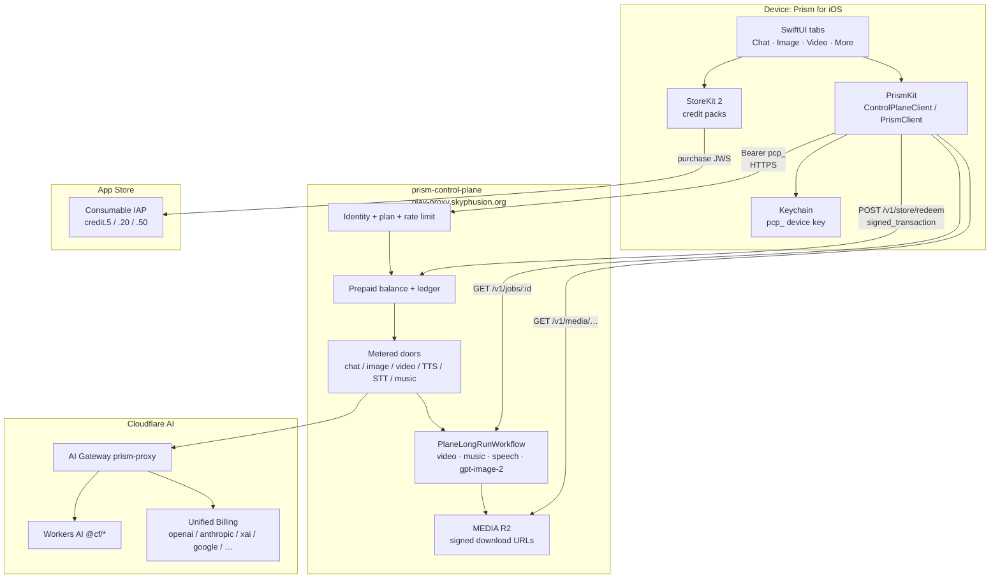
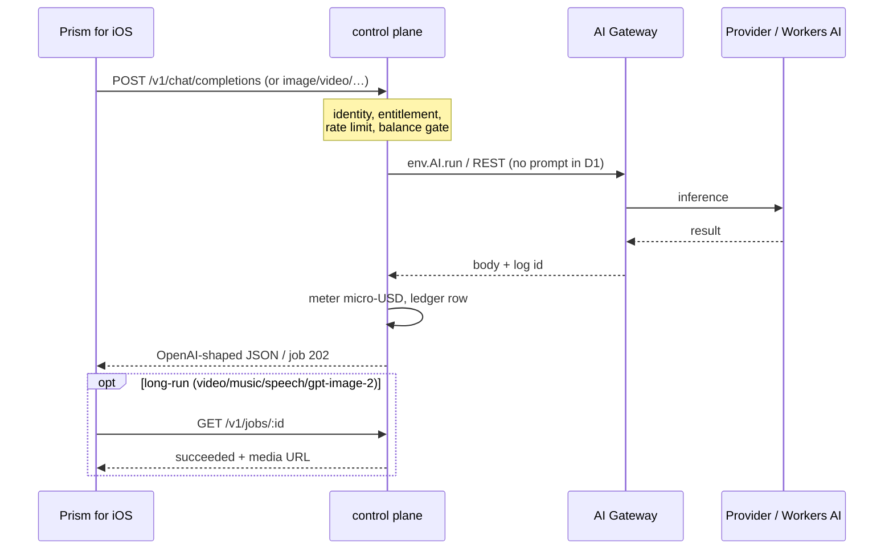

# prism-ios

**License:** AGPL-3.0-only  
**App name:** Prism for iOS  
**Version:** 1.0.0  
**API (playground):** [prism](https://github.com/skyphusion-labs/prism)  
**Control plane:** [prism-control-plane](https://github.com/skyphusion-labs/prism-control-plane)  
**Sibling:** [prism-android](https://github.com/skyphusion-labs/prism-android)

## What this is

AGPL **iOS client** for Prism:

1. **`PrismKit`** (Swift package) -- HTTP clients for the playground Worker and commercial control plane.
2. **`Prism for iOS` app** (SwiftUI) -- enroll / model pick / chat / image / video / audio / music / credit top-up.

Default production backend: **control plane** at `https://play-proxy.skyphusion.org` (Bearer `pcp_…`).  
Optional playground: `https://play.skyphusion.org` (session cookie).

## How the pieces fit together



### Request path (metered inference)



### Credit top-up


## Layout

```
Sources/PrismKit/     -- shared package (API client)
Tests/PrismKitTests/  -- package tests
App/                  -- SwiftUI application sources
project.yml           -- XcodeGen project definition
Prism.xcodeproj/      -- generated iOS app project (open this)
docs/                 -- ASC, TestFlight, 1.0 release notes
```

## Run the app (macOS + Xcode)

```bash
xcodegen generate
open Prism.xcodeproj
# Prism scheme, iPhone simulator, Run
```

Local IAP testing: scheme → Run → Options → StoreKit Configuration → `Configuration.storekit`.

## App Store Connect

| Item | Value |
| --- | --- |
| ASC name | Prism for iOS |
| App id | `6798391677` |
| Bundle | `org.skyphusion.prism` |
| Credit packs | `org.skyphusion.prism.credit.{5,20,50}` |

CLI: [docs/apple-cli.md](docs/apple-cli.md), [docs/ASC.md](docs/ASC.md).

## Package tests

```bash
swift test
```

## Model catalog (control plane)

Same catalog as the commercial plane (**93** models). Entitlement-filtered at `GET /v1/models`.  
Source: [`prism-control-plane/src/catalog.ts`](https://github.com/skyphusion-labs/prism-control-plane/blob/main/src/catalog.ts).

| Modality | Count |
| --- | ---: |
| Chat | 44 |
| Image | 21 |
| Video | 19 |
| Text-to-speech (TTS) | 3 |
| Speech-to-text (STT) | 4 |
| Music | 1 |
| Live voice / STT stream | 1 |
| **Total** | **93** |

### Chat (44)

| Model id | Name |
| --- | --- |
| `anthropic/claude-fable-5` | Claude Fable 5 (Anthropic) |
| `anthropic/claude-sonnet-5` | Claude Sonnet 5 (Anthropic) |
| `anthropic/claude-opus-5` | Claude Opus 5 (Anthropic) |
| `anthropic/claude-opus-4-8` | Claude Opus 4.8 (Anthropic) |
| `anthropic/claude-opus-4-7` | Claude Opus 4.7 (Anthropic) |
| `anthropic/claude-opus-4-6` | Claude Opus 4.6 (Anthropic) |
| `anthropic/claude-sonnet-4-6` | Claude Sonnet 4.6 (Anthropic) |
| `anthropic/claude-haiku-4-5` | Claude Haiku 4.5 (Anthropic) |
| `xai/grok-4.5` | Grok 4.5 (xAI) |
| `xai/grok-4.3` | Grok 4.3 (xAI) |
| `xai/grok-4.20-multi-agent-0309` | Grok 4.20 Multi-Agent (xAI) |
| `xai/grok-4.20-0309-reasoning` | Grok 4.20 Reasoning (xAI) |
| `moonshotai/kimi-k3` | Kimi K3 (Moonshot, 1M ctx) |
| `@cf/moonshotai/kimi-k2.6` | Kimi K2.6 (1T) |
| `@cf/moonshotai/kimi-k2.7-code` | Kimi K2.7 Code (1T, vision) |
| `@cf/openai/gpt-oss-120b` | GPT-OSS 120B (reasoning) |
| `@cf/meta/llama-4-scout-17b-16e-instruct` | Llama 4 Scout (MoE, vision) |
| `@cf/google/gemma-4-26b-a4b-it` | Gemma 4 26B (vision) |
| `@cf/openai/gpt-oss-20b` | GPT-OSS 20B |
| `openai/gpt-5.5` | GPT-5.5 (OpenAI) |
| `openai/gpt-5.5-pro` | GPT-5.5 Pro (OpenAI, Responses) |
| `openai/gpt-5.6-sol` | GPT-5.6 Sol (OpenAI, Responses) |
| `openai/gpt-5.6-terra` | GPT-5.6 Terra (OpenAI, Responses) |
| `openai/gpt-5.6-luna` | GPT-5.6 Luna (OpenAI, Responses) |
| `openai/gpt-5.4` | GPT-5.4 (OpenAI) |
| `openai/gpt-5.4-mini` | GPT-5.4 mini (OpenAI) |
| `openai/o4-mini` | o4-mini (OpenAI, reasoning) |
| `@cf/meta/llama-3.3-70b-instruct-fp8-fast` | Llama 3.3 70B (fp8) |
| `@cf/meta/llama-3.2-11b-vision-instruct` | Llama 3.2 11B (vision) |
| `@cf/meta/llama-3.2-3b-instruct` | Llama 3.2 3B |
| `@cf/qwen/qwen3-30b-a3b-fp8` | Qwen3 30B MoE |
| `@cf/qwen/qwq-32b` | QwQ 32B (reasoning) |
| `@cf/qwen/qwen2.5-coder-32b-instruct` | Qwen2.5 Coder 32B |
| `@cf/deepseek-ai/deepseek-r1-distill-qwen-32b` | DeepSeek R1 32B |
| `@cf/mistralai/mistral-small-3.1-24b-instruct` | Mistral Small 3.1 (vision) |
| `@cf/zai-org/glm-4.7-flash` | GLM-4.7 Flash (Z.AI, 100+ lang) |
| `@cf/zai-org/glm-5.2` | GLM-5.2 (Z.AI, agentic coding) |
| `@cf/nvidia/nemotron-3-120b-a12b` | Nemotron 3 120B (NVIDIA, agentic) |
| `@cf/aisingapore/gemma-sea-lion-v4-27b-it` | SEA-LION v4 27B (SE Asian langs) |
| `google/gemini-3.1-pro` | Gemini 3.1 Pro (Google) |
| `google/gemini-3.5-flash` | Gemini 3.5 Flash (Google) |
| `google/gemini-3.6-flash` | Gemini 3.6 Flash (Google) |
| `@cf/ibm-granite/granite-4.0-h-micro` | Granite 4.0 Micro (IBM) |
| `@cf/meta/llama-3.2-1b-instruct` | Llama 3.2 1B (tiny, cheap) |

### Image (21)

| Model id | Name |
| --- | --- |
| `google/nano-banana-pro` | Nano Banana Pro (Google) |
| `google/nano-banana-2` | Nano Banana 2 (Google) |
| `google/nano-banana-2-lite` | Nano Banana 2 Lite (Google) |
| `google/imagen-4` | Imagen 4 (Google) |
| `openai/gpt-image-1.5` | GPT Image 1.5 (OpenAI) |
| `openai/gpt-image-2` | GPT Image 2 (OpenAI) |
| `recraft/recraftv4` | Recraft V4 (art-directed, opaque) |
| `recraft/recraftv4-1` | Recraft V4.1 (art-directed, opaque) |
| `recraft/recraftv4-1-pro` | Recraft V4.1 Pro (art-directed, opaque) |
| `xai/grok-imagine-image` | Grok Imagine Image (xAI) |
| `xai/grok-imagine-image-quality` | Grok Imagine Image Quality (xAI) |
| `bytedance/seedream-5-pro` | Seedream 5 Pro (ByteDance) |
| `bytedance/seedream-5-lite` | Seedream 5 Lite (ByteDance) |
| `@cf/black-forest-labs/flux-2-klein-9b` | FLUX 2 Klein 9B (frontier) |
| `@cf/black-forest-labs/flux-2-klein-4b` | FLUX 2 Klein 4B (faster) |
| `@cf/black-forest-labs/flux-2-dev` | FLUX 2 Dev (multi-reference) |
| `@cf/black-forest-labs/flux-1-schnell` | FLUX-1 schnell (fast) |
| `@cf/leonardo/lucid-origin` | Lucid Origin (Leonardo) |
| `@cf/leonardo/phoenix-1.0` | Phoenix 1.0 (Leonardo) |
| `@cf/lykon/dreamshaper-8-lcm` | Dreamshaper 8 LCM (fast SD) |
| `@cf/stabilityai/stable-diffusion-xl-base-1.0` | Stable Diffusion XL (SDXL) |

### Video (19)

| Model id | Name |
| --- | --- |
| `google/veo-3.1` | Veo 3.1 (Google) |
| `google/veo-3.1-fast` | Veo 3.1 Fast (Google) |
| `bytedance/seedance-2.0` | Seedance 2.0 (ByteDance) |
| `bytedance/seedance-2.0-fast` | Seedance 2.0 Fast (ByteDance) |
| `bytedance/seedance-2.0-mini` | Seedance 2.0 Mini (ByteDance) |
| `minimax/hailuo-2.3` | Hailuo 2.3 (MiniMax) |
| `minimax/hailuo-2.3-fast` | Hailuo 2.3 Fast (MiniMax) |
| `xai/grok-imagine-video` | Grok Imagine Video (xAI) |
| `xai/grok-imagine-video-1.5-preview` | Grok Imagine Video 1.5 (xAI, preview) |
| `runwayml/gen-4.5` | Gen-4.5 (RunwayML) |
| `alibaba/hh1-t2v` | HappyHorse 1.0 T2V (Alibaba) |
| `alibaba/hh1-i2v` | HappyHorse 1.0 I2V (Alibaba, image-to-video) |
| `alibaba/hh1.1-t2v` | HappyHorse 1.1 T2V (Alibaba) |
| `alibaba/hh1.1-i2v` | HappyHorse 1.1 I2V (Alibaba, image-to-video) |
| `alibaba/wan-2.7-i2v` | Wan 2.7 I2V (Alibaba, image-to-video) |
| `pixverse/v6` | PixVerse v6 |
| `pixverse/v5.6` | PixVerse v5.6 |
| `vidu/q3-pro` | Vidu Q3 Pro |
| `vidu/q3-turbo` | Vidu Q3 Turbo |

### Text-to-speech (3)

| Model id | Name |
| --- | --- |
| `@cf/deepgram/aura-2-en` | Aura-2 English (Deepgram) |
| `@cf/deepgram/aura-2-es` | Aura-2 Spanish (Deepgram) |
| `@cf/myshell-ai/melotts` | MeloTTS (multilingual) |

### Speech-to-text (4)

| Model id | Name |
| --- | --- |
| `@cf/openai/whisper-large-v3-turbo` | Whisper Large v3 Turbo (best) |
| `@cf/openai/whisper` | Whisper (general purpose) |
| `@cf/openai/whisper-tiny-en` | Whisper Tiny EN (fast, beta) |
| `@cf/deepgram/nova-3` | Deepgram Nova-3 (accurate) |

### Music (1)

| Model id | Name |
| --- | --- |
| `minimax/music-2.6` | MiniMax Music 2.6 |

### Live voice / STT stream (1)

| Model id | Name |
| --- | --- |
| `@cf/deepgram/flux` | Deepgram Flux (live mic) |

**Not on native iOS (playground-only):** RAG multi-doc, projects, Discord import, web search, conversation compact against playground history. Plane never stores prompts; chat history is local on device.

## Status (1.0.0)

- Async Workflow jobs: video, music, speech, gpt-image-2
- IAP top-up via plane redeem (plane **0.4.36+** Production JWS)
- Release notes: [docs/RELEASE-1.0.md](docs/RELEASE-1.0.md)
- TestFlight: [docs/TESTFLIGHT.md](docs/TESTFLIGHT.md)
- ASC submit: [docs/ASC-CHECKLIST.md](docs/ASC-CHECKLIST.md)

## Related

- Playground: https://play.skyphusion.org  
- Control plane: https://play-proxy.skyphusion.org  
- Contract: [CONTRACT.md](https://github.com/skyphusion-labs/prism-control-plane/blob/main/docs/CONTRACT.md)  
- Android: https://github.com/skyphusion-labs/prism-android  
